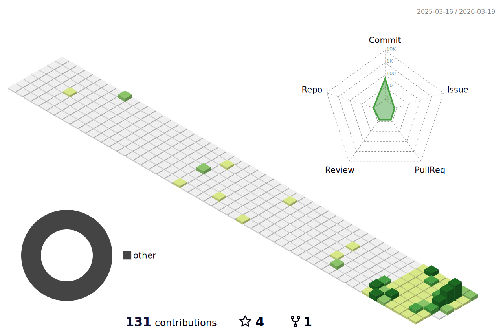
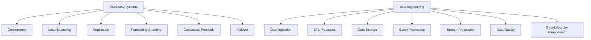

<!--   my-icons -->
<p align="center">
    <a href="https://github.com/IndieMinimalist/indieminimalist"></a>
       
</p>

<!-- my-header-img -->


<a href="https://www.python.org/"></a>
<a href="https://www.rust-lang.org/"></a>
<a href="https://www.linux.org/"></a>

<!--   my-ticker -->

[](https://git.io/typing-svg)

<!--   my-skils -->

| Property                 | Data                                                                                                                                                                                                                                                                                                                                                                                                                                                                                                                                                                                                                                                                                                                                                                                                                                                                                                                                                                                                                                                                                                                                                                                                                                                                                                                                                                                                                                                                                                                                                                                                                                                                                                                                                                                              |
| ------------------------ | ------------------------------------------------------------------------------------------------------------------------------------------------------------------------------------------------------------------------------------------------------------------------------------------------------------------------------------------------------------------------------------------------------------------------------------------------------------------------------------------------------------------------------------------------------------------------------------------------------------------------------------------------------------------------------------------------------------------------------------------------------------------------------------------------------------------------------------------------------------------------------------------------------------------------------------------------------------------------------------------------------------------------------------------------------------------------------------------------------------------------------------------------------------------------------------------------------------------------------------------------------------------------------------------------------------------------------------------------------------------------------------------------------------------------------------------------------------------------------------------------------------------------------------------------------------------------------------------------------------------------------------------------------------------------------------------------------------------------------------------------------------------------------------------------- |
| **Languages**            |                                                                                                                                                                                                                                                                                                                                                                                                                                                                                                                                                                                                                                                                                                                                                                                                                                                                                                                                                                                                                                                                                                                                                                         |
| **Web Technologies**     |                                                                                                                                                                                                                                                                                                                                                                                                                                                                                                                                                                                                                                                                                                                                                                                                                                                   |
| **Backend & Databases**  |                                                                                                                                                                                                                                                                                                                                                                                                                                                                                                                                                                                                                                                                                                                                                                                                                                                          |
| **Tools & Technologies** |                                                                                                                                                                                                                                                                                                                                                                                                                                                      |
| **Concepts**             | <a target="_blank" rel="noopener noreferrer"> </a> <a target="_blank" rel="noopener noreferrer"> </a> <a target="_blank" rel="noopener noreferrer"></a> <a target="_blank" rel="noopener noreferrer"></a> <a target="_blank" rel="noopener noreferrer"></a> <a target="_blank" rel="noopener noreferrer"></a> <a target="_blank" rel="noopener noreferrer"></a> <a target="_blank" rel="noopener noreferrer"></a> <a target="_blank" rel="noopener noreferrer"></a> <a target="_blank" rel="noopener noreferrer"></a> |

<!--   GitHub stats graph -->

### 📈 GitHub Activity:


| . | . |
|-----------------------------------------------------------------------------------------------------------------------------------------|---------------------------------------------------------------------------------------------------------------------------|
|  |  |

</img>

<!--   profile-green-animate -->



<!--  2d history skills -->

</img>

**📫 Reach me:**

<p align="left">
<a href="mailto:david@indieminimalist.com" target="blank"></a>
</p>

<div align="center">
<summary>GitHub Trophies</summary>
</div>

<p align="center"> 
<a href="https://github.com/ryo-ma/github-profile-trophy"></a>
</p>

   <!--machine-learning-->




<!-- ATL -->

```geojson
{
  "type": "FeatureCollection",
  "features": [
    {
      "type": "Feature",
      "id": 1,
      "properties": {
        "ID": 0,
        "City": "Atlanta",
        "State": "Georgia"
      },
      "geometry": {
        "type": "Polygon",
        "coordinates": [
          [
            [
              -84.45,
              33.8
            ],
            [
              -84.35,
              33.8
            ],
            [
              -84.35,
              33.7
            ],
            [
              -84.45,
              33.7
            ],
            [
              -84.45,
              33.8
            ]
          ]
        ]
      }
    }
  ]
}
```

#### Thanks for visiting :heart:

<p align="center"> 


<a href="https://info.flagcounter.com/SDP0"></a>

</p>

---


